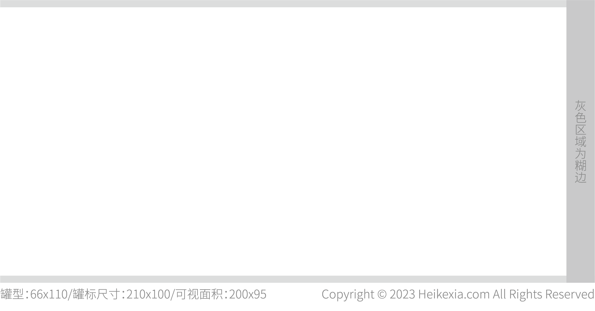
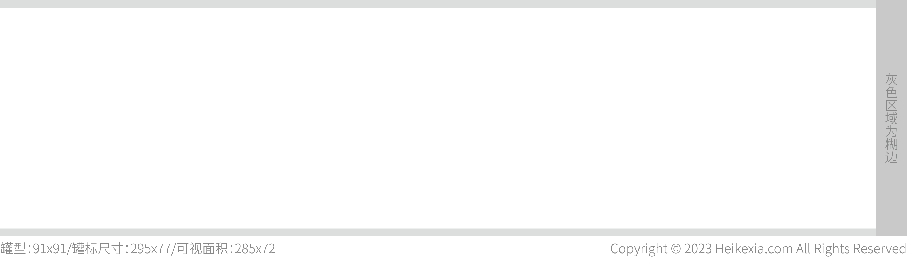
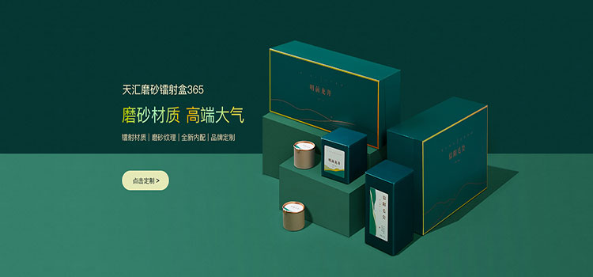
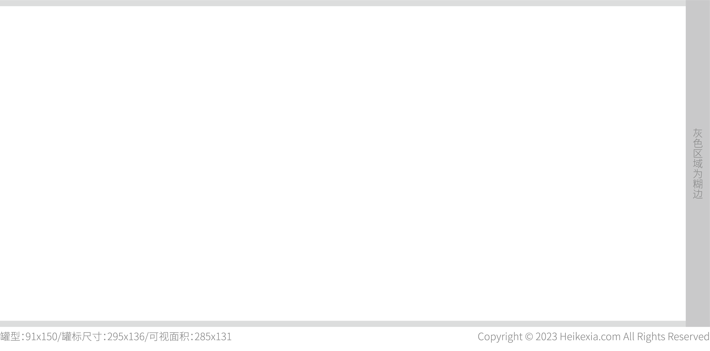
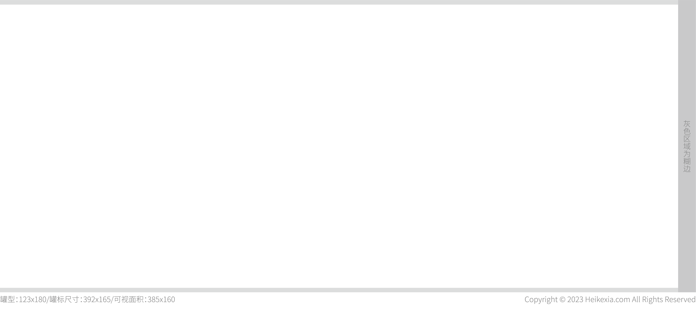
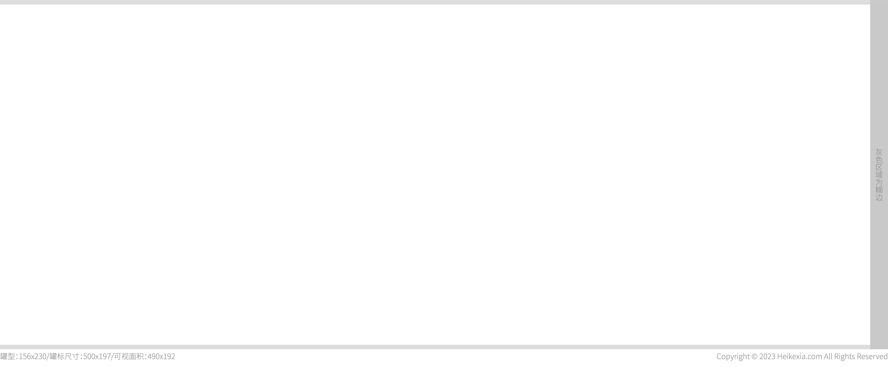

* 罐型：66x70
* 罐标尺寸：210x60
* 可视面积：200x55 

[点击下载图纸](https://github.com/herexu/heikexia/raw/main/drawing/papercan/66x70.zip)

图纸：

实物展示：

---
---

* 罐型：66x110
* 罐标尺寸：210x100
* 可视面积：200x95

[点击下载图纸](https://github.com/herexu/heikexia/raw/main/drawing/papercan/66x110.zip)

图纸：

实物展示：

---
---

* 罐型：91x91
* 罐标尺寸：295x77
* 可视面积：285x72

[点击下载图纸](https://github.com/herexu/heikexia/raw/main/drawing/papercan/91x91.zip)

图纸：

实物展示：

---
---

* 罐型：91x150
* 罐标尺寸：295x136
* 可视面积：285x131

[点击下载图纸](https://github.com/herexu/heikexia/raw/main/drawing/papercan/91x150.zip)

图纸：

实物展示：

---
---

* 罐型：123x180
* 罐标尺寸：392x165
* 可视面积：385x160

[点击下载图纸](https://github.com/herexu/heikexia/raw/main/drawing/papercan/123x180.zip)

图纸：

实物展示：

---
---

* 罐型：156x230
* 罐标尺寸：500x197
* 可视面积：490x192

[点击下载图纸](https://github.com/herexu/heikexia/raw/main/drawing/papercan/156x230.zip)

图纸：

实物展示：

